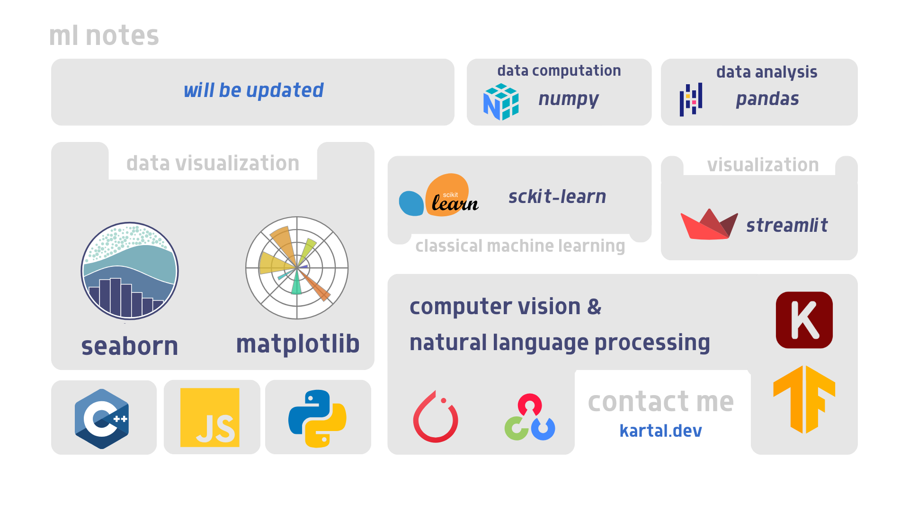

### ml-notes

<!-- TABLE OF CONTENTS -->

  
Table of Contents

  <ol>
    <li>
      <a href="#about-the-project">About The Project</a>
      <ul>
        <li><a href="#built-with">Built With</a></li>
      </ul>
    </li>
    <li>
      <a href="#getting-started">Getting Started</a>
      <ul>
        <li><a href="#prerequisites">Prerequisites</a></li>
        <li><a href="#installation">Installation</a></li>
      </ul>
    </li>
    <li><a href="#usage">Usage</a></li>
    <li><a href="#roadmap">Roadmap</a></li>
    <li><a href="#contributing">Contributing</a></li>
    <li><a href="#license">License</a></li>
    <li><a href="#contact">Contact</a></li>
    <li><a href="#acknowledgments">Acknowledgments</a></li>
  </ol>

<!-- ABOUT THE PROJECT -->

The machine learning (ML) notes from my AI, ML, and deep learning journey cover key topics such as supervised, unsupervised, and reinforcement learning, along with algorithms like decision trees, SVM, KNN, and logistic regression. They also explore deep learning, including CNNs, RNNs, and advanced concepts like transfer learning and GANs. The notes highlight techniques for model evaluation, optimization (gradient descent, regularization), and best practices in data preprocessing and hyperparameter tuning. Overall, they provide a comprehensive overview of foundational and advanced ML concepts and techniques.
